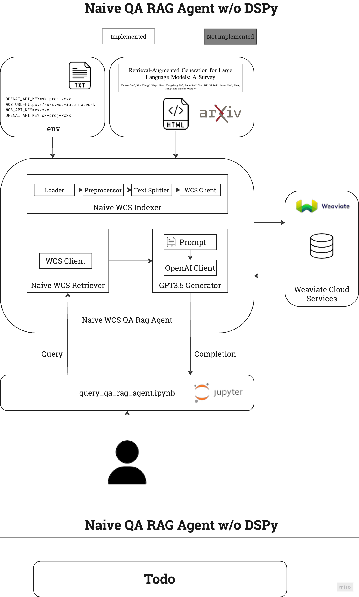

# paper-qa-agent
A RAG-based QA agent for the paper [Retrieval-Augmented Generation for Large Language Models: A Survey](https://arxiv.org/html/2312.10997v5).
## Setup
### .env file setup
Create a `.env` file from this template. Fill in your own OpenAI API Key.
```
WCS_URL=https://tobys-sandbox-oo0vfo50.weaviate.network
WCS_API_KEY=HaDolSevqI9HxhvwMnl9DssgKMObfc0eXfC7
OPENAI_API_KEY=sk-proj-xxxxxxxxxxxxxxxxxxxxxxxxxxxxxxxxxxxxxxxxxxxxxxxx
```
### Install dependencies
```
python -m venv venv
source venv/bin/activate
pip install -r requirements.txt
```
## Usage
Use `query_qa_rag_agent.ipynb`.

## Architecture


## Tech Debt
- `retrievers.py` and `vector_dbs.py` have some duplicate code
- Weaviate connections are not optimized for latency
- `preprocessors.py` 
  - formats tables weird
  - doesn't handle images
  - doesn't format subheadings correctly